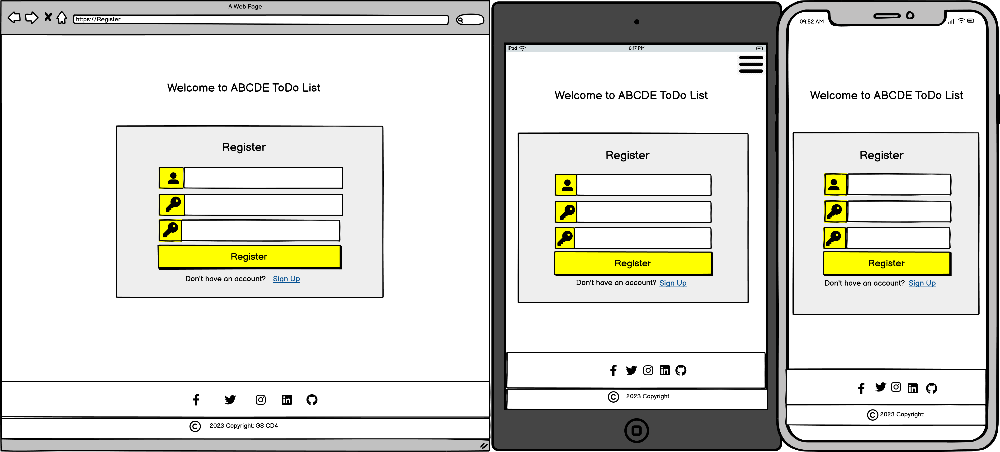
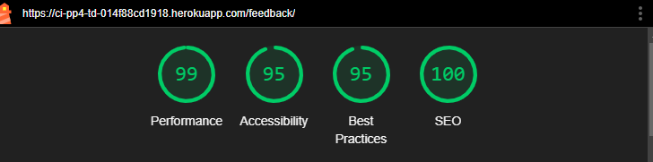
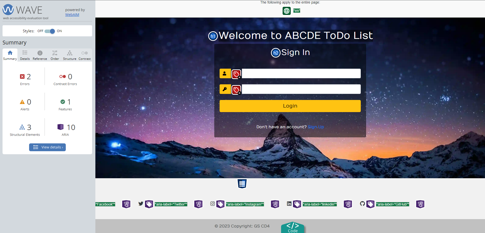
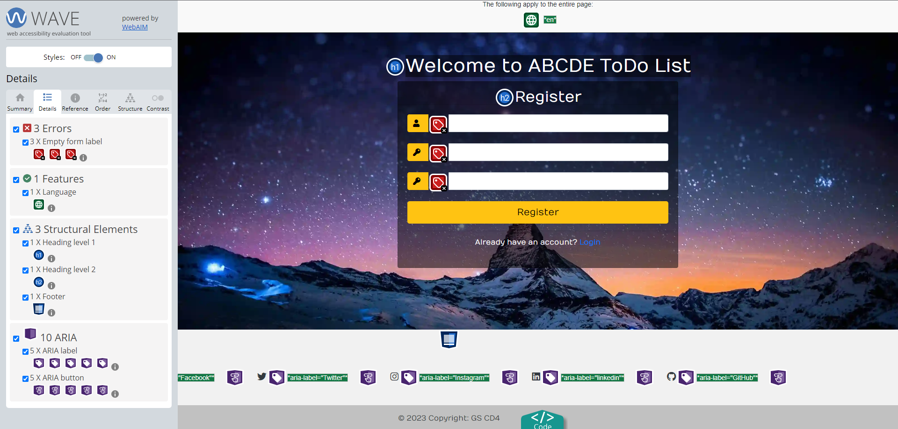

# ABCDE Todo List

**Developer: Arron Beale**

💻 [Visit live website](https://ci-pp4-td-014f88cd1918.herokuapp.com/)  
(Ctrl + click to open in new tab)

## Table of Contents
  - [About](#about)
  - [User Goals](#user-goals)
  - [Site Owner Goals](#site-owner-goals)
  - [User Experience](#user-experience)
  - [User Stories](#user-stories)
  - [Design](#design)
    - [Colours](#colours)
    - [Fonts](#fonts)
    - [Structure](#structure)
      - [Website pages](#website-pages)
      - [Database](#database)
    - [Wireframes](#wireframes)
  - [Technologies Used](#technologies-used)
  - [Features](#features)
  - [Validation](#validation)
  - [Testing](#testing)
    - [Manual testing](#manual-testing)
    - [Automated testing](#automated-testing)
    - [Tests on various devices](#tests-on-various-devices)
    - [Browser compatibility](#browser-compatibility)
  - [Bugs](#bugs)
  - [Heroku Deployment](#heroku-deployment)
  - [Credits](#credits)
  - [Acknowledgements](#acknowledgements)

### About
"ABCDE Todo List" is an application that helps a user organize their time according to Brian Tracy's method, as described in his book "Eat That Frog." Additionally, the website has additional features: 
- Feedback form 
- Admin favorite books.

### User Goals
- Create/Update/Delete tasks.
- Be able to see all tasks in one place.
- Have access to the manual of the application.
- Read the list of self-development books.

### Site Owner Goals

- To provide a solution to allow users to organize to-do tasks.
- Create an intuitive and easy-to-use application to attract more customers.
- Develop a fully responsive and accessible website.

## User Experience

### Target Audience
- Students: managing assignments, study schedules.
- People with Busy Lifestyles: Manage multiple responsibilities.
- Project Managers:  To coordinate and track tasks.
- Individuals Seeking Personal Productivity: To increase personal productivity.
- Freelancers and Gig Workers: To manage their various freelance projects and deadlines.

### User Requirements and Expectations

- Fully responsive website on all devices.
- Ability to use the app on all types of devices.
- Calm and relaxing GUI interface.
- Contact Form to engage with support or leave feedback.
- Easy and intuitive application.
- List of books for self-development.

##### Back to [top](#table-of-contents)

## User Stories

### Users

1.	As a User I can navigate across the site so that I can move to each feature of the site easily. (Must Have)
2.	As a User I can use a navbar, footer, and social icons so that I can navigate the site, access menus, and access socials (Must Have)
3.	As a User I can create a Task. (Must Have)
4.	As a User I can update a Task. (Must Have)
5.	As a User I can delete a Task. (Must Have)
6.  As a User I want to see, task importance. (Must Have)
7.  As a User I want to see, task time deadline. (Should Have)
8.  As a User I want to see, if it is dayly, monthly, or weekly or yearly goald (Should Have)
9.	As a user I can view all my tasks on a single page. (Must Have)
10. As a User I can I am notified so that I know my action of creation, edit, or deletion of a task was succesfull. (Should Have)
11. As a User I can register to create an account so I could create my own todo list to manage my personal tasks. (Must Have)
12. As a user I can login so I can see the list of my tasks, or send an email to site developer. (Must have)
13. As a user I can see my login status so that I know if I am logged in or not  (Should Have)
14. As a User I can view the site's books which will help me to use application more efficiently (Should Have)
15. As a User I can read manual to have better undstanding how to use an application (Must Have)

### Admin / Authorised User

16. In my role as an Admin or Authorized User, I have the capability to log in to the admin console for backend access.
17. As an Admin or Authorized User, I am able to manually include, remove, or update books in the list of favorite books.
18. As an Admin or Authorized User, I can view messages that have been sent by users through the contact form.
19. As an Admin, I have the ability to view, update, or delete user tasks from the backend.
20. As an Admin, I can create user, delete user , block and unblock useer.

### Site Owner  
23. As a Site Owner I want site to be responsive (Must have)
24. As a Site Owner  I want to add validation to the contact form, to make sure that all required fields are completed.

### Kanban, Epics & User Stories
- GitHub Kanban was used to track all open user stories
- Epics were created using the milestones feature
- Backlog, In Progress, Done headings were used in the kanban

Epics

User Stories

Kanban

##### Back to [top](#table-of-contents)

## Design

### Colours

I chose bright colours for footer and navbar to make application more positive.
I added a pcture with star sky to make application relaxing.

### Structure

#### Website pages

The site was designed for the user to be familiar with the layout such as a navigation bar along the top of the pages and a hamburger menu button for smaller screen.

The footer contains all relevant social media links that the business has so the user can visit any social media site and follow the business there to expand the businesses followers, likes and shares.

- The site consists of the following pages:
  - Homepage with cards for the user to choose to book a table, view the food or drinks menu.
  - Food menu has the current list of all available foods from the database sorted by starters, mains and desserts
  - Drinks menu has the current list of all available drinks from the databse sorted by type
  - Blog page has a paginated list of blogs posted by an admin or authorised user, 4 per page
  - Blog expanded displays a blog the user has selected so they can read the blog, if they are logged in they can also leave a comment which will then need to be approved before it is displayed
  - Book page allows registered users to book a table , guest count, date requested, time requested and table location
  - My bookings displays all bookings for the user that they have made, bookings in the past are automatically expired
  - Edit booking allows the user to change their date, time, table and guest count
  - Cancel booking allows the user to cancel the booking which will then delete it from the database
  - Contact us allows the user to send us a DM if the are registered, or they can contact us from the displayed email and phone number or visit the address listed.
  - Login / Logout allows users to login to make bookings, view, edit, and delete bookings
  - Register allows the user to regiser so they can use the booking system
  - 404 error page to display if a 404 error is raised

#### Database

- Built with Python and the Django framework with a database of a Postgres for the deployed Heroku version(production)
- Two database model shows all the fields stored in the database

Show diagram

##### User Model
The User Model contains the following:
- user_id
- password
- last_login
- is_superuser
- username
- first_name
- last_name
- email
- is_staff
- is_active
- date_joined

##### FoodItem Model
The FoodItem Model contains the following:
- food_id
- food_name
- description
- price
- available

##### DrinkItem Model
The DrinkItem Model contains the following:
- drink_id
- drink_name
- description
- price
- available

##### Table Model
The Table Model contains the following:
- table_id (PrimaryKey)
- table_name
- max_seats
- available

##### Booking Model
The Booking Model contains the following:
- booking_id (PrimaryKey)
- created_date
- requested_date
- requested_time
- table (ForeignKey)
- guest (ForeignKey)
- seats
- guest_count

##### Post Model
The Post Model contains the following:
- title
- post_id (PrimaryKey)
- author (ForeignKey)
- created_date
- updated_date
- content
- featured_image
- excerpt
- slug
- status

##### Comment Model
The Comment Model contains the following:
- post (ForeignKey)
- name
- email
- body
- created_date
- approved
- Meta: created_on

##### ContactUs Model
The ContactUs Model contains the following:
- contact_id (PrimaryKey)
- name (ForeignKey)
- email (ForeignKey)
- phone (ForeignKey)
- body

### Wireframes
The wireframes were created using Balsamiq
###  Wireframes

Login

Register

Home

Manual

Books

ContactForm

DeleteTask

CreateUpdateTask

404 Page

## Features

### Home page
- Home page includes nav bar, main body and a footer

See feature images

### Logo & Navigation
- Shows logo designed for a to-do list
- Responsive across various screen sizes
- Transforms into hamburger menu on smaller screens
- Shows active user
- Provides access to all available pages directly from the current page

See feature images

### Footer
- Contains social media links and copyright
- displayed across all pages

See feature images

### Sign up / Register
- Allow users to register an acoount
- Username and password is required.

See feature images

### Login
-  User can login to create/update/delete a task, view list of tasks, send feedback message, see list of favourite books.

See feature images

### Logout
- Allows the user to securely log out

See feature images

### Contact Form
- Allows the user to contact admin/site owner to share feedback

See feature images

### Books
- Allows the user to see the list of favorite books.
- User may see the book title, book cover, book description, book's star rating, number of reviews.
- User may click on "Buy on Amazon" to purchase the book from Amazon.
- User may utilize pagination to view the complete list of books.

See feature images

### Task List 
- Allows the user to see all their their tasks for Dayly, Weekly, Montlhy, Yearly goals
- User can see, Severity of the task, deadline of the task, complete status
- Allows a user an option to create a task, update/view the task, delete the task

See feature images

### View/Edit Task page
- Allows the user to edit/view task. 

See feature images

### Delete Task page
- Allows user to delete task. 

See feature images

### 404  page
- Page is displayed when user enters incorrect URL. 

See feature images

## Technologies Used

### Languages & Frameworks

- HTML
- CSS
- Javascript
- Python
- Django

### Libraries & Tools

- [Am I Responsive](https://ui.dev/amiresponsive)
- [Cloudinary](https://cloudinary.com/)
- [Balsamiq](https://balsamiq.com/)
- [Favicon.io](https://favicon.io)
- [Google Fonts](https://fonts.google.com/)
- [jQuery](https://jquery.com)
- [ElePhantSQL](https://www.elephantsql.com/)
- [Chrome dev tools](https://developer.chrome.com/docs/devtools/)
- [Font Awesome](https://fontawesome.com/)
- [GitHub](https://github.com/)
- [gitpod](https://www.gitpod.io/)
- [Bootstrap v.4.6.2](https://getbootstrap.com/docs/4.6/getting-started/introduction/)
- [Heroku](https://dashboard.heroku.com/apps)

- Validation:
  - [WC3 Validator](https://validator.w3.org/)
  - [Jigsaw W3 Validator](https://jigsaw.w3.org/css-validator/)
  - [JShint](https://jshint.com/)
  - [Pycodestyle(PEP8)](https://pypi.org/project/pycodestyle/)
  - [Lighthouse](https://developers.google.com/web/tools/lighthouse/)
  - [Wave Validator](https://wave.webaim.org/)

##### Back to [top](#table-of-contents)

### Food Menu
- The food menu displays all available foods on the menu
- Menu is seperated by starters, mains and desserts
- Items can be added via the admin panel in the backend by staff
- Staff can create, update and delete foods via the admin panel
  

See feature images

### Drinks Menu
- The drinks menu displays all available foods on the menu
- Menu is seperated by wines, beers and cocktails
- Items can be added via the admin panel in the backend by staff
- Staff can create, update and delete foods via the admin panel 
  

See feature images

### Blog
- The blog displays each post made by a staff member
- Paginations is used to display 4 posts per page
  

See feature images

### Blog Expanded
- Expands into the selected blog the user wishes to read
- Displays a featured image uploaded by the poster
- If no image is uploaded a default image is then used
- Registerd user can comment on the blog
  

See feature images

### Comments
- Comments made are set to pending approval status to ensure nothing bad is displayed
- Only registered users can comment on a blog post
- Staff can approve comments via the admin panel on the backend
  

See feature images

### Contact Us
- Registered users can DM staff via the message box
- Contact info such as, phone, email, and address is displayed
- A Google Map is embedded with the address for users to use
  

See feature images

### Social Media Links
- A logo and link is used for each social media displayed
- All links open in a new tab to ensure user is not directed away from the business
- Displayed on all pages
  

See feature images

### Pagination
- Pagination is used on the bookings list and the blog page
- Ensures the page is kept tidy as only 4 items are displayed per page
  

See feature images

##### Back to [top](#table-of-contents)

## Validation

The W3C Markup Validation Service

Login

Register

Home

Task Create Update

Task Delete

Manual

Contact Form

Books

404

### CSS Validation
The W3C Jigsaw CSS Validation Service

Style.css

### PEP8 Validation
[PEP8 Validation Service](https://pep8ci.herokuapp.com/) The code underwent verification for PEP8 compliance and successfully passed without any errors or warnings.

TODO(base) Aplication. 

base/admin.py

base/apps.py

base/forms.py

base/models.py

base/url.py

base/views.py

test_models.py

test_views.py

test_urls.py

Books

books/admin.py

books/apps.py

books/models.py

books/urls.py

books/views.py

test_models.py

test_views.py

test_urls.py

forms.py

Contact Form

contactform/admin.py

contactform/apps.py

contactform/models.py

contactform/urls.py

contactform/views.py

test_models.py

test_views.py

test_urls.py

forms.py

### Lighthouse

Performance, best practices and SEO was tested using Lighthouse.

#### Desktop

Login

Register

Homepage

Create/Update Task

Delete Task

Manual

Feedback

Books

#### Mobile

Login

Register

Homepage

Create Update Task

Delete Task

Manual

Feedback

Books

### Wave
WAVE was used to test the websites accessibility.

Login

We have two false positive errors.
Waive check says that labels are empty, but in reality the 
the labels have icons instead of text.

Register

We have 3 false positive errors, like before.
Waive check says that labels are empty, but in reality the 
the labels have icons instead of text.

HomePage

We see 2-8 false positive errors: "A link contains no text."
This happens because I used icons instead of text to create links 

Create/Update Task

Delete Tasks

Manual

Feedback

Books

We have false positive contrast error. Pagination background and page number
have very good contrast

404

We have one alert "Suspicious link text" which means that purpose  of the 
link is not described well, but the link is part of sentence "Otherwise, Click here to redirect to homepage.  Sentence expains the purpose of the link.
For this reason the alert is false positive.

##### Back to [top](#table-of-contents)

## Testing

1. Manual testing
2. Automated testing

### Manual testing

1. As a User I can navigate across the site so that I can move to each feature of the site easily

**Step** | **Expected Result** | **Actual Result**
------------ | ------------ | ------------ |
| Click on the 'Home' link in the navigation bar | Homepage will load| Works as expected |
| Click on the 'Register' link in the navigation bar | Sign up page will load| Works as expected |
| Click on the 'Login' link in the navigation bar | Login page will load| Works as expected |
| Click on the 'Menus' link in the navigation bar, select 'Food Menu' | Food menu page will load| Works as expected |
| Click on the 'Menus' link in the navigation bar, select 'Drinks Menu' | Drinks menu page will load| Works as expected |
| Click on the 'Menus' link in the navigation bar, select 'Drinks Menu' | Drinks menu page will load| Works as expected |
| Click on the 'Blog' link in the navigation bar | Blog page will load| Works as expected |
| Click on the 'Book' link in the navigation bar | Reservations page will load| Works as expected |
| Click on the 'Book' link in the navigation bar | Reservations page will load| Works as expected |
| Click on the 'Contact Us' link in the navigation bar | Contact us page will load| Works as expected |
| Click on the 'My Bookings' link in the navigation bar | Booking list page will load| Works as expected |
| Click on the 'Logout' link in the navigation bar | Logout page will load| Works as expected |

2. As a User I can use a navbar, footer, and social icons so that I can navigate the site, access menus, and access socials

**Step** | **Expected Result** | **Actual Result**
------------ | ------------ | ------------ |
 | See test 1 | See test 1 | Works as expected |
 | Scroll to footer at bottom of page | find footer | Works as expected |
 | Scroll to footer at bottom of page | find social links | Works as expected |

3. As a Site Owner I can provide a contact us page so that users can get in touch with my business

**Step** | **Expected Result** | **Actual Result**
------------ | ------------ | ------------ |
| Click on the 'Contact Us' link in the navigation bar | Contact us page will load| Works as expected |

4. As a User I can view the opening hours and contact details so that I know when the business is open and how to contact them via email, phone and socials

**Step** | **Expected Result** | **Actual Result**
------------ | ------------ | ------------ |
| Click on the 'Contact Us' link in the navigation bar, scroll to bottom of page | Find contact details and opening hours | Works as expected |

5. As a User I can create a booking by selecting a date and time so that I can reserve my table

**Step** | **Expected Result** | **Actual Result**
------------ | ------------ | ------------ |
| Click on the 'Book' link in the navigation bar | Find the booking form on the reservations page | Works as expected |

6. As a User I can update my booking so that I can choose another available time and date

**Step** | **Expected Result** | **Actual Result**
------------ | ------------ | ------------ |
| From 'My Bookings' click 'Edit' on booking to be edited| Find the edit booking form loaded  | Works as expected |

7. As a User I can delete my booking so that I can cancel my table reservation

**Step** | **Expected Result** | **Actual Result**
------------ | ------------ | ------------ |
| From 'My Bookings' click 'Cancel' on booking to be cancelled| Find the cancel booking prompt loaded  | Works as expected |

8. As a user I can view my booking so that I can remind myself of the date and time I have booked

**Step** | **Expected Result** | **Actual Result**
------------ | ------------ | ------------ |
| Click on the 'My Bookings' link in the navigation bar | Booking list will display all bookings made| Works as expected |

9. As an Admin / Authorised User I can log in so that I can access the back end of the site

**Step** | **Expected Result** | **Actual Result**
------------ | ------------ | ------------ |
| Visit the admin page https://ci-pp4-the-diplomat.herokuapp.com/admin/login/?next=/admin/ | Enter admin login credentials, gain access to back end | Works as expected |

10. As an Admin / Authorised User I can manually add a booking so that I can book a table if someone phones, or emails the business

**Step** | **Expected Result** | **Actual Result**
------------ | ------------ | ------------ |
| Visit the admin page https://ci-pp4-the-diplomat.herokuapp.com/admin/login/?next=/admin/ | Enter admin login credentials, gain access to back end | Works as expected |
| Click on the Bookings button the the left panel, select add booking | Booking form is displayed | Works as expected |

11. As an Admin / Authorised User I can accept or reject bookings so that we avoid double bookings

**Step** | **Expected Result** | **Actual Result**
------------ | ------------ | ------------ |
| Visit the admin page https://ci-pp4-the-diplomat.herokuapp.com/admin/login/?next=/admin/ | Enter admin login credentials, gain access to back end | Works as expected |
| Click on the Bookings button the the left panel, select a booking id | Booking info is displayed | Works as expected |
| Click Status dropdown | Find different booking status to select and save | Works as expected |

12. As an Admin I can login to add or remove items from the food and cocktail menu so that we can add more food and drinks or remove them

**Step** | **Expected Result** | **Actual Result**
------------ | ------------ | ------------ |
| Visit the admin page https://ci-pp4-the-diplomat.herokuapp.com/admin/login/?next=/admin/ | Enter admin login credentials, gain access to back end | Works as expected |
| Click on the Food Items on the left panel, select a Add Food Item | Add food form is displayed | Works as expected |
| Click on the Drink Items on the left panel, select a Add Drink Item | Add drink form is displayed | Works as expected |
| See test 13 | See test 13 | Works as expected |

13. As a Admin I can create, read, update and delete food and drinks items from the database so that we can add, remove, rename and view all our food and drinks items

**Step** | **Expected Result** | **Actual Result**
------------ | ------------ | ------------ |
| Visit the admin page https://ci-pp4-the-diplomat.herokuapp.com/admin/login/?next=/admin/ | Enter admin login credentials, gain access to back end | Works as expected |
| Click on the Food Items / Drink Items on the left panel, select an item by id | Item Form is displayed allowing, editing and deletion, see test 12 for creation |Works as expected |

14. As a User I can I am notified so that I know my action of creation, edit, or deletion of a booking has been successful

**Step** | **Expected Result** | **Actual Result**
------------ | ------------ | ------------ |
| From the reservations page, create a booking | A message will be displayed upon completion, Javascript makes it disappear after 3 seconds | Works as expected |
| From the bookings list page, edit a booking | A message will be displayed upon completion, Javascript makes it disappear after 3 seconds | Works as expected |
| From the bookings list page, cancel a booking | A message will be displayed upon completion, Javascript makes it disappear after 3 seconds | Works as expected |

15. As a User I can register as prompted so that I can make a booking if I wish reserve a table

**Step** | **Expected Result** | **Actual Result**
------------ | ------------ | ------------ |
| Click on the 'Register' link in the navigation bar | Register an account to allow bookings to be made | Works as expected |

16.  As a User I can register to create an account so that my details are stored for faster booking in future

**Step** | **Expected Result** | **Actual Result**
------------ | ------------ | ------------ |
| See test 15 | See test 15 | Works as expected |
| Click on the 'Book' link in the navigation bar | Find the booking form with user email inserted automatically | Works as expected |

17. As a user I can login so that I can book a table

**Step** | **Expected Result** | **Actual Result**
------------ | ------------ | ------------ |
| Click on the 'Login' link in the navigation bar | Log in, user now able to book a table | Works as expected |
| Click on the 'Book' link in the navigation bar | Find the booking form on the reservations page | Works as expected |

18. As a user I can see my login status so that I know if I am logged in or not

**Step** | **Expected Result** | **Actual Result**
------------ | ------------ | ------------ |
| While logged in, view navigation bar | Logout button should be visible | Works as expected |

19. As an Admin / Authorised User I can toggle booking confirmation to auto or manual mode so that on busy days manual mode can be used to reduce double bookings

**Step** | **Expected Result** | **Actual Result**
------------ | ------------ | ------------ |
| User story not implemented | Possible future feature | N/A |

20. As an Admin / Authorised User I can search through bookings and menus so that I can find the information I am looking for

**Step** | **Expected Result** | **Actual Result**
------------ | ------------ | ------------ |
| From the admin panel, select Bookings / Food, drinks menus | Find search box and filters on displayed page | Works as expected |

21. As an Admin / Authorised User I can filter bookings by date so that I can see what bookings we have for a particular day

**Step** | **Expected Result** | **Actual Result**
------------ | ------------ | ------------ |
| From the admin panel, select Bookings | Find  filters on displayed right panel of page | Works as expected |

22. As a User I can view the site's blog so that I can learn additional information and read articles

**Step** | **Expected Result** | **Actual Result**
------------ | ------------ | ------------ |
| Select Blog in navigation panel at top of page | Blog page loads with published Blog posts | Works as expected |

23. As a User I can view the food and drink menu so that I can decide wether to eat at the business

**Step** | **Expected Result** | **Actual Result**
------------ | ------------ | ------------ |
| Select Menus then food menu dropdown in navigation panel at top of page | Food Menu page loads | Works as expected |
| Select Menus then drinks menu dropdown in navigation panel at top of page | Drinks Menu page loads | Works as expected |

24. As a Site Owner I can validate data entered into my site so that all submitted data is correct to avoid errors

**Step** | **Expected Result** | **Actual Result**
------------ | ------------ | ------------ |
| From Booking page, make a booking with a phone number that is too short | Error message is displayed | Works as expected |
| From Booking page, make a booking with a date / table that is already booked | Error message is displayed | Works as expected |

25. As a User I can not book a date in the past so that my booking is valid

**Step** | **Expected Result** | **Actual Result**
------------ | ------------ | ------------ |
| From the booking page, click requested date calender icon | Calender will open with all dates from yesterday and older greyed out, cannot select | Works as expected |

26. As a User I can view blog posts page by page so that I can browse without seeing an overloaded page

**Step** | **Expected Result** | **Actual Result**
------------ | ------------ | ------------ |
| Select Blog from navigation panel at top of page | Blog page loads, paginated to display only 4 per page | Works as expected |

27. As a User I can not book a table already booked so that my booking is valid and not double booked

**Step** | **Expected Result** | **Actual Result**
------------ | ------------ | ------------ |
| From the bookings page, attempt to book a table and date already booked | Error message displays to say booking not possible | Works as expected |

### Automated testing

- Testing was done using the built in Django module, unittest.
- Coverage was also usesd to generate a report

Bar & Grill App, test_models.py

Bar & Grill App, test_views.py

Bar & Grill App, test_urls.py

Bar & Grill App, Coverage

Bookings App, test_models.py

Bookings App, test_views.py

Bookings App, test_urls.py

Bookings App, Coverage

### Device Testing & Browser compatibility

The site uses to test on various real world devices was [BrowserStack](https://ci-pp4-the-diplomat.herokuapp.com/)  

This allowed me to test on real devices and not just device emulators.

The following devices were used to test my site:

Samsung Galaxy S22 Ultra

Apple iPhone 13

Google Pixel 5

Mozilla Firefox (v105 latest)

Google Chrome (v106 latest)

Safari (Monteray v15.3 latest)

##### Back to [top](#table-of-contents)

## Bugs

| **Bug** | **Fix** |
| ------- | ------- |
| css not loading| the css folder was created in uppercase as CSS, renamed and fixed |
| While logged in as a user, on edit bookings page, if you changed the url booking number and if the number was a valid booking for another user it would access the booking | Defensive programming to make sure that only bookings made by the user would be visible |
| Double bookings | Adjusted code to check that the date, time and table were unique together and to give an error to indicate to the user that the booking was unavailable for that date, time and table combination |
| Food item description not showing on menu | A "p" element was used to encase the jinja code, once removed the food item description was then visible |
| Foods not listing by type, starters, manins and desserts | I needed to fix the database loop for the food items to specify the food type had to be a starter to display in the starter section of the menu, and the same for mains and desserts |
| Drinks not listing by type, wines, beers and cocktails | I needed to fix the database loop for the drinks item to specify the drink type had to be a wine to display in the wine section of the menu, and the same for beers and cocktails |
| Card links not working on home page for book a table, food menu and drinks menu | The links were not set within urls.py so just needed to be wired up to load each relevant page |
| Booking form accepting phone number that are too short | I used Django PhoneNumberField to ensure only valid phone formats were accepted |

##### Back to [top](#table-of-contents)

### Heroku Deployment

[Official Page](https://devcenter.heroku.com/articles/git) (Ctrl + click)

This application has been deployed from Github using Heroku. Here's how:

1. Create an account at heroku.com

2. Create an app, give it a name for such as ci-pp4-the-diplomat, and select a region

3. Under resources search for postgres, and add a Postgres database to the app

Heroku Postgres

1. Note the DATABASE_URL, this can be set as an environment variable in Heroku and your local deployment(env.py)

2. Install the plugins dj-database-url and psycopg2-binary.

3. Run pip3 freeze > requirements.txt so both are added to the requirements.txt file

4. Create a Procfile with the text: web: gunicorn the_diplomat.wsgi

5. In the settings.py ensure the connection is to the Heroku postgres database, no indentation if you are not using a seperate test database.
I store mine in env.py

6. Ensure debug is set to false in the settings.py file

7. Add localhost, and ci-pp4-the-diplomat.herokuapp.com to the ALLOWED_HOSTS variable in settings.py

8. Run "python3 manage.py showmigrations" to check the status of the migrations

9. Run "python3 manage.py migrate" to migrate the database

10. Run "python3 manage.py createsuperuser" to create a super/admin user

11. Run "python3 manage.py loaddata categories.json" on the categories file in products/fixtures to create the categories

12. Run "python3 manage.py loaddata products.json" on the products file in products/fixtures to create the products

13. Install gunicorn and add it to the requirements.txt file using the command pip3 freeze > requirements.txt

14. Disable collectstatic in Heroku before any code is pushed using the command heroku config:set DISABLE_COLLECTSTATIC=1 -a ci-pp4-the-diplomat

15. Ensure the following environment variables are set in Heroku

16. Connect the app to GitHub, and enable automatic deploys from main if you wish

17. Click deploy to deploy your application to Heroku for the first time

18. Click on the link provided to access the application

19. If you encounter any issues accessing the build logs is a good way to troubleshoot the issue

### Fork Repository
To fork the repository by following these steps:
1. Go to the GitHub repository
2. Click on Fork button in upper right hand corner

### Clone Repository
You can clone the repository by following these steps:
1. Go to the GitHub repository 
2. Locate the Code button above the list of files and click it 
3. Select if you prefere to clone using HTTPS, SSH, or Github CLI and click the copy button to copy the URL to your clipboard
4. Open Git Bash
5. Change the current working directory to the one where you want the cloned directory
6. Type git clone and paste the URL from the clipboard ($ git clone https://github.com/YOUR-USERNAME/YOUR-REPOSITORY)
7.Press Enter to create your local clone.

##### Back to [top](#table-of-contents)

## Credits

### Images

Images used were sourced from Pexels.com and an AI image generator (Dalle2) was used for an image with the permission from OpenAI

### Code

Bootstrap dark navigation theme was used alongside boostrap classes and carousel

##### Back to [top](#table-of-contents)

## Acknowledgements

### Special thanks to the following:
- Code Institute
- My Mentor Mo Shami