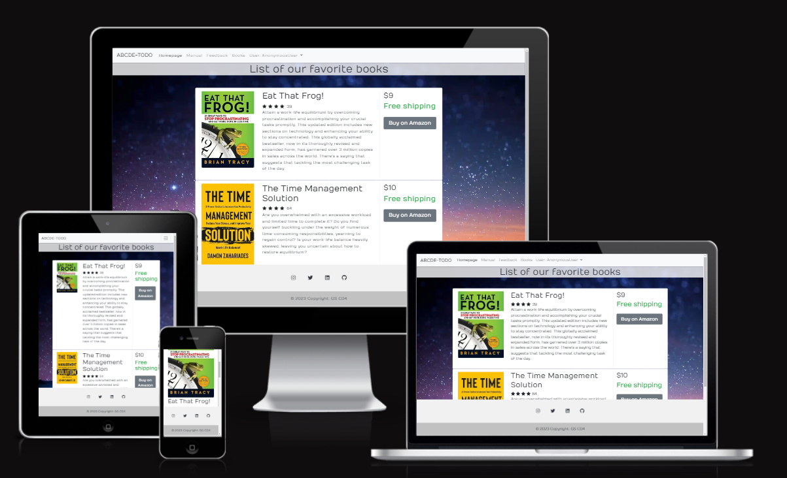
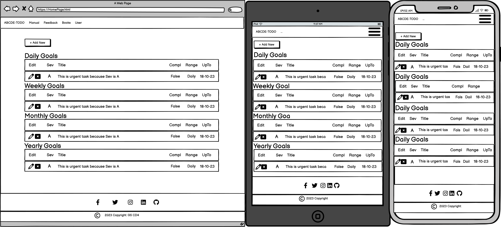
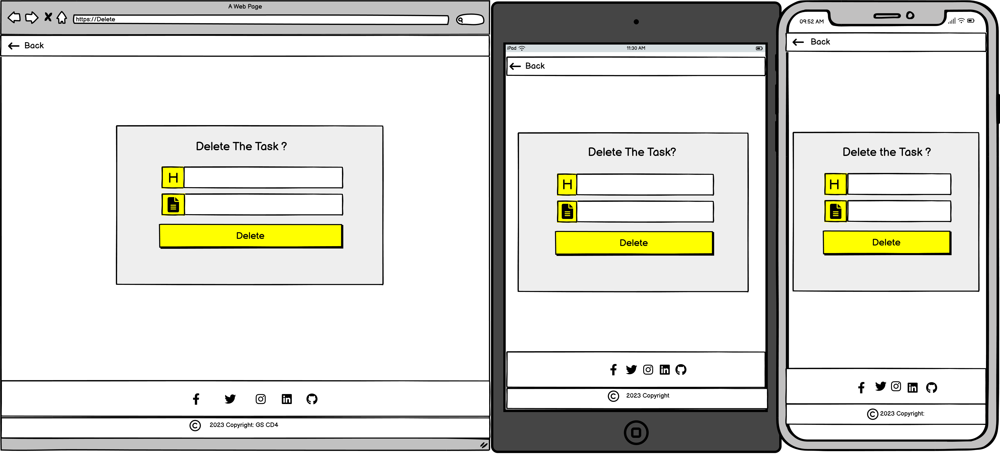
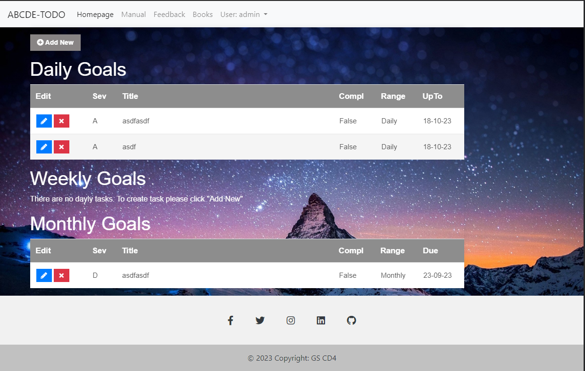
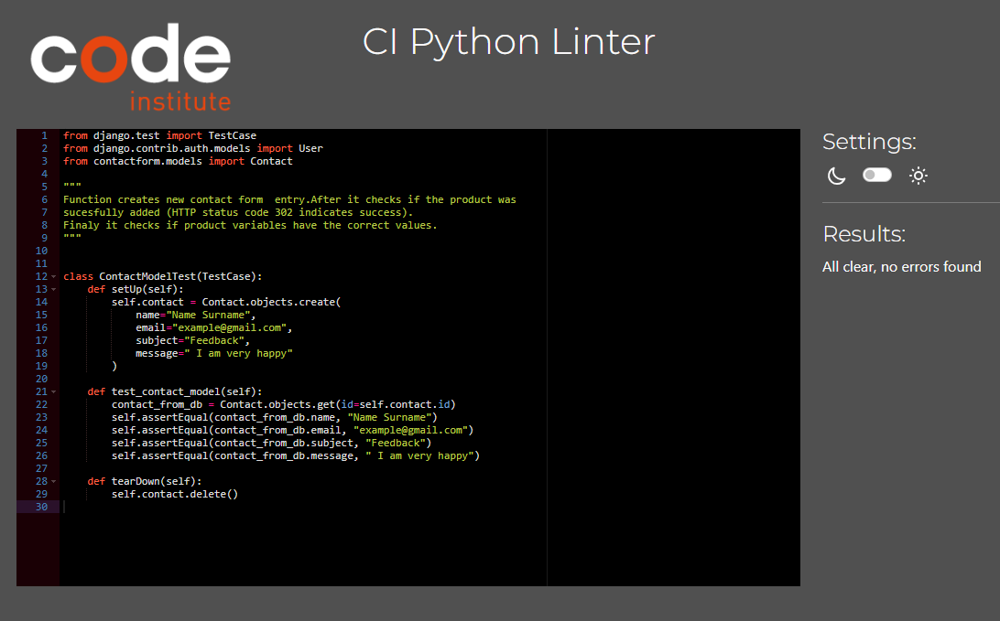
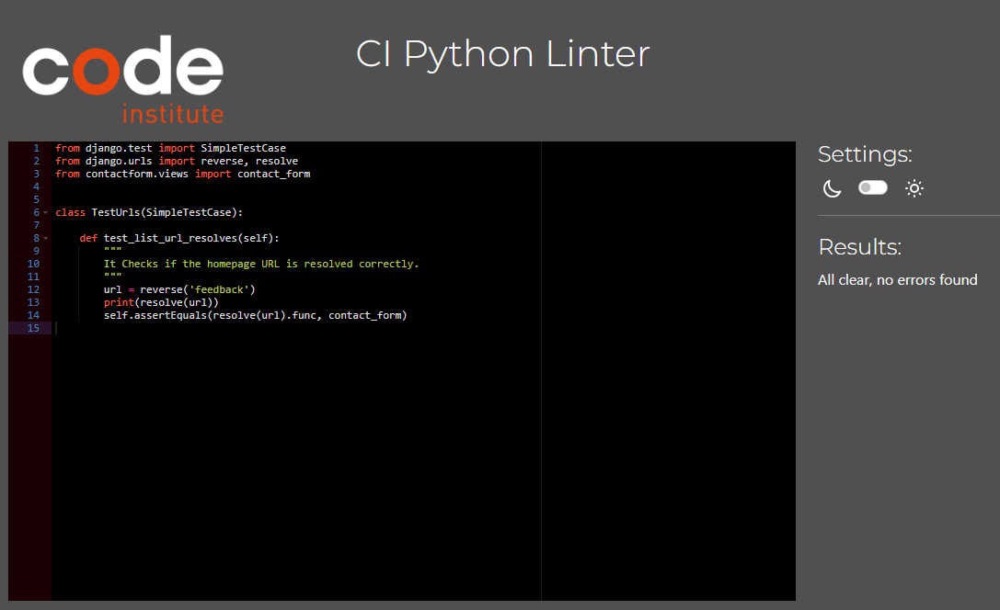
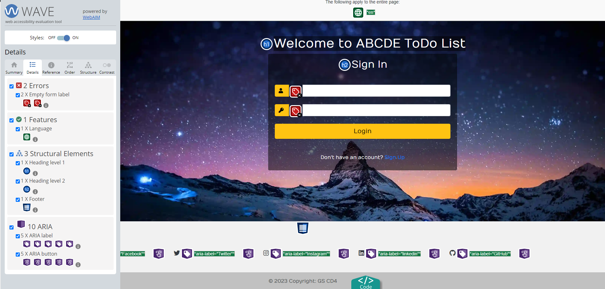
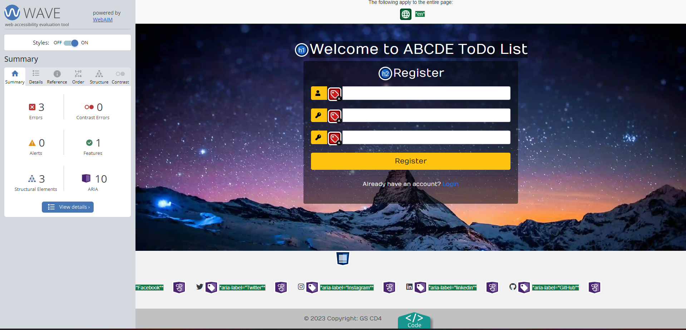
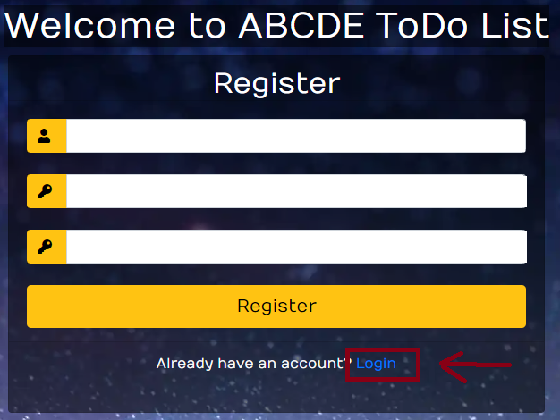
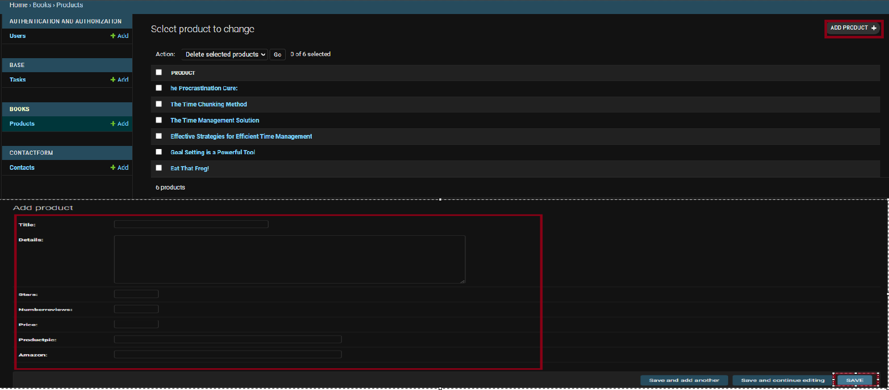

# ABCDE Todo List

**Developer: Arron Beale**

💻 [Visit live website](https://ci-pp4-td-014f88cd1918.herokuapp.com/)  
(Ctrl + click to open in new tab)

## Table of Contents
  - [About](#about)
  - [User Goals](#user-goals)
  - [Site Owner Goals](#site-owner-goals)
  - [User Experience](#user-experience)
  - [User Stories](#user-stories)
  - [Design](#design)
    - [Colours](#colours)
    - [Structure](#structure)
      - [Website pages](#website-pages)
      - [Database](#database)
    - [Wireframes](#wireframes)
  - [Technologies Used](#technologies-used)
  - [Features](#features)
  - [Validation](#validation)
  - [Testing](#testing)
    - [Manual testing](#manual-testing)
    - [Automated testing](#automated-testing)
    - [Tests on various devices](#performing-tests-on-various-devices)
    - [Browser compatibility](#browser-compatability)
  - [Bugs](#bugs)
  - [Heroku Deployment](#heroku-deployment)
  - [Credits](#credits)
  - [Acknowledgements](#acknowledgements)

### About
"ABCDE Todo List" is an application that helps a user organize their time according to Brian Tracy's method, as described in his book "Eat That Frog." Additionally, the website has additional features:
- Feedback form 
- Admin favorite books.

### User Goals
- Create/Update/Delete tasks.
- Be able to see all tasks in one place.
- Have access to the manual of the application.
- Read the list of self-development books.

### Site Owner Goals

- To provide a solution to allow users to organize to-do tasks.
- Create an intuitive and easy-to-use application to attract more customers.
- Develop a fully responsive and accessible website.

## User Experience

### Target Audience

- Students: managing assignments, study schedules.
- People with Busy Lifestyles: Manage multiple responsibilities.
- Project Managers: To coordinate and track tasks.
- Individuals Seeking Personal Productivity: To increase personal productivity.
- Freelancers and Gig Workers: To manage their various freelance projects and deadlines

### User Requirements and Expectations

- Fully responsive website on all devices.
- Ability to use the app on all types of devices.
- Calm and relaxing GUI interface.
- Contact Form to engage with support or leave feedback.
- Easy and intuitive application.
- List of books for self-development.

## User Stories

1. As a user, I would like to log in to my account.
2. As a user, I would like to create a new account.
3. As a user, I would like to be able to move from the Register page to the Log In page.
4. As a user, I would like to create a new task. While creating the task, I may modify the following fields: 'title,' 'description,' 'importance,' 'frequency,' 'deadline.'
5. As a user, I would like to update a task. While updating the task, I may modify the following fields: 'title,' 'description,' 'importance,' 'frequency,' 'deadline.'
6. As a user, while on the "Create/Update Task" page, I need to go back without modifying or creating a task.
7. As a user, I would like to delete a task.
8. As a user, while on the "Delete" page, I would like to return to the homepage without deleting the task.
9. As a user, I would like to read the manual to understand how to use the application.
10. As a user, I would like to be able to send an email to the admin to contact him or share feedback.
11. As a user, I would like to see the list of books the admin proposes for self-development and visit the Amazon website where I can buy them.

### Admin / Authorised User

12. In my role as an Admin or Authorized User, I have the capability to log in to the admin console for backend access.
13. As an Admin, I can create users, delete users.
14. As an Admin, I want to modify user's settings: First Name, Permissions.
15. As an Admin, I want to filter users by staff, superuser, or active status.
16. As an Admin, I am able to manually include, remove, or update books in the list of favorite books.
17. As an Admin, I can view messages that have been sent by users through the contact form.
18. As an Admin, I can view, update, delete users' tasks.
19. As an Admin, I can filter tasks by: importance, frequency, user.
20. As an Admin, I would like a user to find all company's social links and navigate to them by clicking footer's icons.

## Design

### Colours

I chose bright colors for the footer and navbar to make the application more positive.
I added a picture with a starry sky to make the application relaxing.

### Structure

#### Website pages

The site was designed for the user to be familiar with the layout, such as a navigation bar along the top of the pages and a hamburger menu button for smaller screens.

The footer contains all relevant social media links that the business has, so the user can visit any social media site and follow the business there to expand the business's followers, likes, and shares.

The site consists of the following pages:

- Login page where the user can log in to his account.
- Register page where the user can register.
- Homepage where the user can see all his tasks.
- Create/Update task page, where the user can create or update the task.
- Delete page, where the user can delete the task.
- Manual page, where the user can read how to use the application.
- Contact/Feedback page, where the user can complete a form to share his feedback or just send an email to the admin/owner.
- Books page, where the user can see the admin's favorite books on sales development.
- 404 error page to display if a 404 error is raised.

#### Database

- Built with Python and the Django framework with a database of ElephantSQL for the deployed Heroku version (production).

Show diagram

##### User Model
The User Model contains the following:
- user_id
- password
- last_login
- is_superuser
- username
- first_name
- last_name
- email
- is_staff
- is_active
- date_joined

##### Contact Model
The Contact Model contains the following:
- id
- name
- email
- subject
- message

##### Books Model
The Books Model contains the following:
- id
- title
- details
- stars
- numberreviews
- price
- productpic
- amazon

##### Tasks Model
The Tasks Model contains the following:
- id
- user
- title
- description
- complete
- created
- frequency
- importance
- completed
- due

### Wireframes
The wireframes were created using Balsamiq
###  Wireframes

Login

Register

Home

Manual

Books

ContactForm

DeleteTask

CreateUpdateTask

404 Page

## Features

### Home page
- Home page includes navbar, main body, and a footer.

See feature images

### Logo & Navigation
- Shows logo designed for a to-do list.
- Responsive across various screen sizes.
- Transforms into hamburger menu on smaller screens.
- Shows active user.
- Provides access to all available pages directly from the current page.

See feature images

### Footer
Contains social media links and copyright, displayed across all pages.

See feature images

### Sign up / Register
- Allow users to register an account. Username and password are required

See feature images

### Login
- Users can log in to create, update, or delete tasks, view a list of tasks, send feedback messages, and see a list of favorite books.

See feature images

### Logout
- Enables users to securely log out

See feature images

### Contact Form
- Enables users to contact the admin/site owner to share feedback.

See feature images

### Books
- Allows the user to view the list of favorite books.
- Users may see the book title, book cover, book description, star rating, and the number of reviews.
- Users can click on 'Buy on Amazon' to purchase the book from Amazon.
- Users can utilize pagination to view the complete list of books.

See feature images

### Task List 
- Allows the user to see all their tasks for Daily, Weekly, Monthly, Yearly goals.
- Users can see the severity of the task, deadline of the task, and completion status.
- Allows users the option to create a task, update/view the task, and delete the task.

See feature images

### View/Edit Task page
- Allows the user to edit/view tasks.

See feature images

### Delete Task page
- Allows the user to delete a task.

See feature images

### Social Media Links and CopyRight
- A logo and link are used for each social media platform displayed.
- All links open in a new tab to ensure the user is not directed away from the business.
- Displayed on all pages.
  

See feature images

### Pagination
- Pagination is used on the bookings list and the blog page.
- This ensures that the page is kept tidy, with only two items displayed per page.
  

See feature images

### 404  page
- A page is displayed when the user enters an incorrect URL.

See feature images

## Technologies Used

### Languages & Frameworks

- HTML
- CSS
- Javascript
- Python
- Django

### Libraries & Tools

- [Am I Responsive](https://amiresponsive.blogspot.com/)
- [Cloudinary](https://cloudinary.com/)
- [Balsamiq](https://balsamiq.com/)
- [Google Fonts](https://fonts.google.com/)
- [jQuery](https://jquery.com)
- [ElePhantSQL](https://www.elephantsql.com/)
- [Chrome dev tools](https://developer.chrome.com/docs/devtools/)
- [Font Awesome](https://fontawesome.com/)
- [GitHub](https://github.com/)
- [gitpod](https://www.gitpod.io/)
- [Bootstrap v.4.6.2](https://getbootstrap.com/docs/4.6/getting-started/introduction/)
- [Heroku](https://dashboard.heroku.com/apps)

- Validation:
  - [WC3 Validator](https://validator.w3.org/)
  - [Jigsaw W3 Validator](https://jigsaw.w3.org/css-validator/)
  - [JShint](https://jshint.com/)
  - [Pycodestyle(PEP8)](https://pypi.org/project/pycodestyle/)
  - [Lighthouse](https://developers.google.com/web/tools/lighthouse/)
  - [Wave Validator](https://wave.webaim.org/)

## Validation

The W3C Markup Validation Service

Login

Register

Home

Task Create Update

Task Delete

Manual

Contact Form

Books

404

### CSS Validation
The W3C Jigsaw CSS Validation Service

Style.css

### PEP8 Validation
[PEP8 Validation Service](https://pep8ci.herokuapp.com/) The code underwent verification for PEP8 compliance and successfully passed without any errors or warnings.

TODO(base) Aplication. 

base/admin.py

base/apps.py

base/forms.py

base/models.py

base/url.py

base/views.py

python/base/test_forms.py

python/base/test_models.py

python/base/test_views.py

python/base/test_urls.py

Books

books/admin.py

books/apps.py

books/models.py

books/urls.py

books/views.py

python/books/test_models.py

python/books/test_views.py

python/books/test_urls.py

Contact Form

contactform/admin.py

contactform/apps.py

contactform/models.py

contactform/urls.py

contactform/views.py

python/contactform/test_models.py

python/contactform/test_views.py

python/contactform/test_urls.py

### Lighthouse

Performance, best practices, and SEO were tested using Lighthouse.

#### Desktop

Login

Register

Homepage

Create/Update Task

Delete Task

Manual

Feedback

Books

#### Mobile

Login

Register

Homepage

Create Update Task

Delete Task

Manual

Feedback

Books

### Wave
WAVE was used to test the website accessibility.

Login

We have two false positive errors. The WAVE
check indicates that labels are empty, but in reality,
 the labels have icons instead of text

Register

We have 3 false positive errors, as before. The WAVE
check says that labels are empty, but in reality,
the labels have icons instead of text.

HomePage

We observe 2-8 false positive errors, specifically, 'A link contains
no text.' This occurs because I used icons instead of text to create links.

Create/Update Task

Delete Tasks

Manual

Feedback

Books

We have a false positive contrast error. Pagination background 
and page numbers have very good contrast.

404

We have one alert: 'Suspicious link text,' which indicates that the purpose of the link is not
described well. However, the link is part of the sentence 'Otherwise, click here to redirect
to the homepage.' This sentence explains the purpose of the link. For this reason, the alert 
is a false positive.

## Testing

1. Manual testing
2. Automated testing
### Users

### Manual testing

## User Stories

1.  As a User I would like to login to my account.

**Step** | **Expected Result** | **Actual Result**
------------ | ------------ | ------------ |
 | Open the application URL and navigate to the login page. Enter user credentials to log in. | User loged in. | Works as expected. |

2. As a User I would like to create a new account.

**Step** | **Expected Result** | **Actual Result**
------------ | ------------ | ------------ |
| On login page click "Sign Up". On register page register your username and password. | New account is created and user logged in. | Works as expected. |

3.  As a User I would like to be able to move from Register page to Log In Page.

**Step** | **Expected Result** | **Actual Result**
------------ | ------------ | ------------ |
| On Register page, click on  link "Login". | User is redirected to Log In Page. | Works as expected. |

4. As a user, I would like to create a new task. While creating the task, I may modify the following fields: 'title', 'description',  'importance','frequency', 'deadline'.

 **Step** | **Expected Result** | **Actual Result**
------------ | ------------ | ------------ |
| On the homepage, click 'Add New.' On the Create/Update page, complete the fields: 'title,' 'task description,' select the 'deadline,' 'severity,' 'importance,' 'frequency,' and click Submit. | A new task is created with the required fields filled out. | Works as expected |

5. As a user, I would like to update a new task. While updating the task, I may modify the following fields: 'title', 'description',  'importance','frequency', 'deadline'.

**Step** | **Expected Result** | **Actual Result**
------------ | ------------ | ------------ |
| Click on a pencil icon in the edit column. On the 'Create/Update Task' page, you may modify one or more of the following fields: 'title,' 'description,' 'importance,' 'frequency,' 'deadline.' | Task Modified | Works as expected |

6. As a user, while I am on "Create/Update Task" I need to go back, without modifying or creating task.

**Step** | **Expected Result** | **Actual Result**
------------ | ------------ | ------------ |
| While on "Create/Update" page click on an arrow on left top corner. | User is redirected to Homepage  | Works as expected |

7. As a user I would like to delete the task.

**Step** | **Expected Result** | **Actual Result**
------------ | ------------ | ------------ |
| Click on x in Edit colon. On Delete page click "Delete". | The task is deleted  | Works as expected |

8. As a user, while on "Delete" page I would like to return to homepage without deleting the task.

**Step** | **Expected Result** | **Actual Result**
------------ | ------------ | ------------ |
| While on a "Delete" page, click on the arrow on the top left corner.| The user redirected back to homepage, task is not deleted.  | Works as expected |

9. As a user,  I would like to read manual, to understand how to use the application.

**Step** | **Expected Result** | **Actual Result**
------------ | ------------ | ------------ |
| While on homepage, click "Manual" in navigation bar. | "The user is redirected to the manual page where they can read instructions.  | Works as expected |

10. As a user I would like to be able to send an email to admin, to contact him or share feedback.

**Step** | **Expected Result** | **Actual Result**
------------ | ------------ | ------------ |
| While on the homepage, click on 'Feedback,' complete all fields, and then click 'Send Feedback'. | UThe user is redirected to the homepage and sees the message that the email was received  | Works as expected |

11. As a user I would like to see the list of book the admin propose for self development, and visit Amazon website where I can buy it.

**Step** | **Expected Result** | **Actual Result**
------------ | ------------ | ------------ |
| While on the homepage, click on 'Books.' View the book covers, descriptions, and ratings. Click the 'Buy on Amazon' button to navigate to the Amazon page, where you can make a purchase | The user is redirected to the 'Books' page and then to Amazon's website.  | Works as expected |

## Testing Admin user stories:

12. In my role as an Admin or Authorized User, I have the capability to log in to the admin console for backend access.

**Step** | **Expected Result** | **Actual Result**
------------ | ------------ | ------------ |
| navigate to https://ci-pp4-td-014f88cd1918.herokuapp.com/admin/ Complete username and Password and click next to login | User redirected to admin console.  | Works as expected |

## Admin/Site owner user stories.

13. As an Admin, I can create user, delete user .

**Step** | **Expected Result** | **Actual Result**
------------ | ------------ | ------------ |
| In the admin console, click on 'Users.' Then, click on 'Add User' in the top right corner to create a new user. Complete the username and password fields and click 'Save.' To delete a user, select the user, choose 'Delete selected user' from the 'Action' menu, and click 'Go. | One user is created, one user is deleted.  | Works as expected |

14. As an Admin, I want to modify user's settings: Firs Name, Perissions.

**Step** | **Expected Result** | **Actual Result**
------------ | ------------ | ------------ |
| In the admin console, click on 'Users,' select a user, modify the user's settings, and click 'Save | User's settings are updated.  | Works as expected |

15. As an Admin, I want to filter user by staff , superuser or active status.

**Step** | **Expected Result** | **Actual Result**
------------ | ------------ | ------------ |
| In the admin console, click on 'Users,' then click on 'Filter,' and select the required filter settings. | Users are filtered according to the specified filter settings.  | Works as expected |

16. As an Admin  I am able to manually include, remove, or update books in the list of favorite books.

**Step** | **Expected Result** | **Actual Result**
------------ | ------------ | ------------ |
| In the admin console, click on 'Products.' In the top right corner, select 'Add Product,' complete all the fields, and click 'Save.' To update a product, click on the product's name, update all required fields, and click 'Save.' To delete a product, select the product, choose 'Delete selected products' from the 'Action' menu, and then click 'Go.'| Book added, updated, deleted successfully. | Works as expected |

Add a new book.

Update a book.

Delete a book.

17. As an Admin , I can view messages that have been sent by users through the contact form.

**Step** | **Expected Result** | **Actual Result**
------------ | ------------ | ------------ |
| In admin console, click on Contacts, and click on the text of a message.  | A new window opens, and I can see full   message which was sent by user. | Works as expected |

18. As an Admin , I can view, update, delete user's tasks

**Step** | **Expected Result** | **Actual Result**
------------ | ------------ | ------------ |
| In admin console, Navigate to "Tasks", Click on task.  | A new window opens,where I can see, update or delete the task | Works as expected |

19. As an Admin , I can filter tasks by: importance, frequency, user.

**Step** | **Expected Result** | **Actual Result**
------------ | ------------ | ------------ |
| Navigate to "Tasks". Find Filter, set desired filters.  | Tasks are filterd according to filter settings. | Works as expected |

20. As an Admin , I would like a user to find all company's social links, and navigate to them be clicking footer's icons.

**Step** | **Expected Result** | **Actual Result**
------------ | ------------ | ------------ |
| On homepage find footer. Click on one of the icons.  | User is redirected to social media | Works as expected |

### Automated testing

- Testing was done using the built in Django module, unittest.
- Coverage was also usesd to generate a report

 

base, test_models.py

base, test_views.py

base, test_urls.py

base, test_form.py

 

books, test_models.py

books, test_views.py

books, test_urls.py

 

contactform, test_models.py

contactform, test_views.py

contactform, test_urls.py

 

Coverage Report For All Applications

### Device Testing & Browser compatibility

###  Performing tests on various devices

Testing of the website was conducted on the following devices:

- Latitude 5520

- Redmi Note 10

- Samsung Tablet A10.1

Furthermore, the website underwent testing using the Device Toggling feature of Google Chrome Developer Tools, which includes all available device options.

###  Browser compatability

The following browsers were used to test the website:

- Google Chrome

- Mozilla Firefox

- Microsoft Egde

## Bugs

| **Bug** | **Fix** |
| ------- | ------- |
| css not loading| The static files configuration in settings.py was not correct. After fixing it, the issue was resolved |
| User could see the tasks of other users| Defensive programming: Configured users to see only their tasks by adding 'mydata = Task.objects.filter(user=request.user)' to the equation.|
|  Users could update and delete other users' tasks |  Adjusted code to check if the task belongs to the user; if not, it shows a 404 page. |
| The footer was not at the bottom of the page when the content was big | "I changed the footer class to 'class="text-center text-white fixed-bottom"'. After that, the issue was fixed on all pages. |
| The contact form was not saving subject of a message in admin. | Modified views.py script for feedback page to link correct subject to correct variable. |
| The homepage was not displaying correctly when the user had no tasks. | I found that it was counting tasks for other users. I added an additional filter to make the application count tasks only for the logged-in user by including 'user=request.user'.|
| Update page did not open, when I pressed on update button | The links were not set within urls.py, so they just needed to be wired up to load each relevant page." |
| Admin panel has "section" which is not used | Opened ticket with support, they informed me to leave everything as it is https://res.cloudinary.com/dtdqranu0/image/upload/v1699719979/pictures/glxfztk7cqr8r4n9puc9.png |
| In login, while testing  register/login page on different resolutions,  form form-control shrinks differently than input field. For this reason. For this reason"form-control" and input field have different sizes" https://res.cloudinary.com/dtdqranu0/image/upload/v1699790878/pictures/xcvu2nx2dfcq6gvxndrd.png | Created chat with support. Support informed me to leave everything as it is and just to add comment to bugs that bootstrap code does not work as expected https://res.cloudinary.com/dtdqranu0/image/upload/v1699790885/pictures/xd6fcamkuxomaizc2cee.png |

### Heroku Deployment

[Official Page](https://devcenter.heroku.com/articles/git) (Ctrl + click)

### Heroku Deployment

Before deploying to Heroku, environment variables must be defined in the Django project so that local development functions correctly. Once these environment variables are set up in the workspace, the project can be deployed, and the environment variables can be copied into Heroku as config vars (to ensure the deployed app works correctly with 3rd party dependencies).

1. Create a file called env.py in the root directory of your workspace and ensure that the file is included in .gitignore. These variables should NOT be committed or pushed to GitHub.
2. import os to the file.
3. os.environ['DATABASE_URL'] = URL copied from ElephantSQL
4. os.environ['SECRET_KEY'] = A randomly generated key of your choosing. This keeps django from serving data to/from an unauthorised source.
5. os.environ['CLOUDINARY_URL'] = The URL from a cloudinary account. This can be found on the following page on the cloudinary website: www.cloudinary.com

Cloudinary

These environment variables can now be accessed and configured in the settings.py file of the django project.

The website was deployed to Heroku using the following process:

1. Login to  [Heroku](https://dashboard.heroku.com/) 

Heroku Login

2. Select "New" and then choose "Create new app" from the options in the top right corner of the screen.

Create New App

3. Specify an app name, choose a location, and then click on 'create app'.

Create New App

4. On the subsequent page, navigate to the deploy tab and choose the option to connect to GitHub.
5. Sign in to your GitHub account as prompted.

Github Deploy

6. Choose the repository you wish to link to the Heroku app.

Select Repository

7. Navigate to the settings and click on "Reveal Config Vars" under "Config Vars."

Select Repository

8. Scroll down to the "Config Vars" section and input the configuration variables mentioned at the beginning of this README section. Additionally, include a variable with the key 'PORT' and the value '8000' to prevent build errors. The final configuration should resemble this example:
KEY: DATABASE_URL
VALUE: postgresurlexample123.com

Configure Vars

9. Return to the 'deploy' tab.

10.  Choose automatic deploys to enable Heroku to build the site with new changes whenever updates are pushed to GitHub.

Automatic Deploy

11.  In the 'manual deploy' section below, ensure that the selected branch is 'main,' and then click 'deploy branch.

Automatic Deploy

12.  The site should be successfully built, and Heroku will furnish a URL for the constructed site

### Clone Repository
Follow these steps to clone the repository:
1. Go to the GitHub repository 
2. Find the "Code" button located above the file list and click on it.
3. Choose whether you prefer to clone via HTTPS, SSH, or Github CLI, and then click on the copy button to copy the URL to your clipboard.
4. Open Git Bash
5. Navigate to the directory where you would like to clone the directory and set it as the current working directory.
6. Type git clone and paste the URL from the clipboard ($ git clone https://github.com/YOUR-USERNAME/YOUR-REPOSITORY)
7. Hit the Enter key to create your local clone.

Please check the following link for more information: https://docs.github.com/en/repositories/creating-and-managing-repositories/cloning-a-repository

## Credits

### Images

Backgroun image was taken from https://getwallpapers.com/

### Code

1. First version of the App was built from Django Tutorial of Dennis Ivy: https://www.youtube.com/watch?v=llbtoQTt4qw
2. Code which is locatd on Bootstrap 4.6 page https://getbootstrap.com/docs/4.6/getting-started/introduction/  was used to deploy NavBar and Footer
3. Pagination was taken from this video: https://www.youtube.com/watch?v=wY_BNsxCEi4&t=61s
4. Login, Register, Feedback pages are inspired from: https://bootsnipp.com/snippets/vl4R7
5. Automatic testing: https://www.youtube.com/watch?v=0MrgsYswT1c&list=PLbpAWbHbi5rMF2j5n6imm0enrSD9eQUaM&index=2

## Acknowledgements

### Special thanks to the following:
- Code Institute
- My Mentor Mo Shami